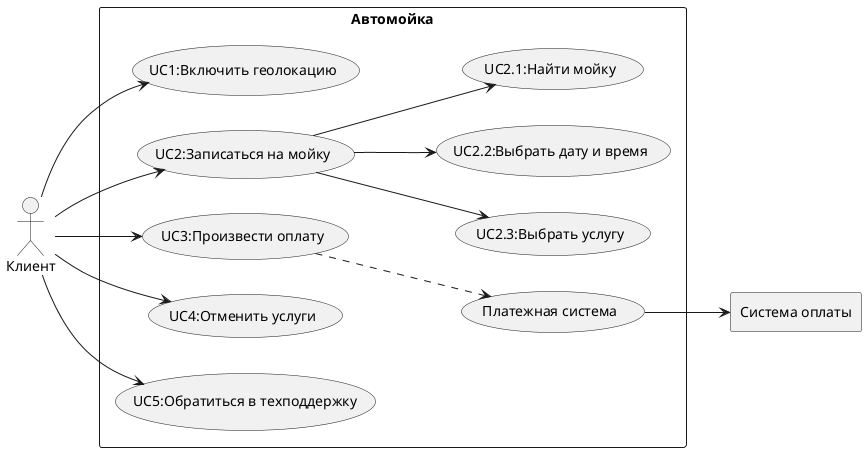

# Учебное приложение по автомойке
 

## Показатели:
  <table>
  <tr>
    <td>Регион</td>
    <td>Сахалинская область</td>
  </tr>
  <tr>
    <td>Численность региона</td>
    <td>500К человек</td>
  </tr>
  <tr>
    <td>DAU</td>
    <td>15% от 500К = 75К </td>
  </tr>
  <tr>
    <td>RPS</td>
    <td>75K/24/3600 ~= 1</td>
  </tr>
</table>

## Функциональные требования:
 

  
Код Use Case

  

### Сценарии использования
#### UC1: Включить геолокацию
 <table>
  <tr>
    <td>Участники</td>
    <td>Пользователь приложения</td>
  </tr>
  <tr>
    <td>Предусловия</td>
    <td> Пользователь зарегистрирован и авторизирован в приложение</td>
  </tr>
  <tr>
    <td>Условия для срабатывания</td>
    <td>Пользователь входит в приложение</td>
  </tr>
  <tr>
    <td>Признак успешности</td>
    <td>Геолокация включилась</td>
  </tr>
</table>

##### Базовый сценарий:
1. Система запрашивает разрешение на включение/использование геолокации. 
2. IF: Геолокацию включили, 
THEN: Система переходит к [UC2](#uc2-записаться-на-мойку),  
ELSE: Система переходит к альтернативному сценарию.
4. Сценарий завершен.

##### Альтернативный:
1. Система отключает фунции поиска ближайщей мойки.
2. Система переходит к [UC2](#uc2-записаться-на-мойку)

<!-- ///////////////////////////////////////////////////////////////////////////////////////////////////////////////////////////// -->

#### UC2: Записаться на мойку

<table>
  <tr>
    <td>Участники</td>
    <td>Пользователь приложения</td>
  </tr>
  <tr>
    <td>Предусловия</td>
    <td> Пользователь зарегистрирован и авторизован. Услуги и автомойка выбраны</td>
  </tr>
  <tr>
    <td>Условия для срабатывания</td>
    <td>Пользователь нажимает кнопку "Найти мойку"</td>
  </tr>
  <tr>
    <td>Признак успешности</td>
    <td>Пользователь записался на мойку</td>
  </tr>
</table>

##### Базовый сценарий:
###### 1. UC2.1:
1. IF: Функции поиска ближайшей мойки включены, 
THEN: Система отображает ищет ближайшие мойки и даёт возможность выбрать другие мойки,  
ELSE: Система отображает все мойки в регионе.
2. Пользователь выбирает мойку.
###### 2. UC2.2:
1. Пользователь выбирает время.
###### 3. UC2.3:
1. Пользователь выбирает услугу.
###### 4. Перейти к сценарию [UC3](#uc3-произвести-оплату)
###### 5. Сценарий завершен.

<!-- ///////////////////////////////////////////////////////////////////////////////////////////////////////////////////////////// -->

#### UC3: Произвести оплату

<table>
  <tr>
    <td>Участники</td>
    <td>Пользователь приложения</td>
  </tr>
  <tr>
    <td>Предусловия</td>
    <td> Пользователь зарегистрирован и авторизован. Услуги, автомойка и время и дата выбраны.</td>
  </tr>
  <tr>
    <td>Условия для срабатывания</td>
    <td>Пользователь нажимает кнопку "Оплатить" и выберет способ оплаты</td>
  </tr>
  <tr>
    <td>Признак успешности</td>
    <td>Оплата прошла успешна</td>
  </tr>
</table>

##### Базовый сценарий:
1. Система проверяет наличие выбранных пунктов "Автомойка", "Услуги" и "Дата и время".
2. Система формирует итоговый вариант записи пользователя.
3. Система отображает экран "Итоговый вариант записи".
4. Система ожидает выбора способа оплаты. 
IF: Способ оплаты - "Онлайн оплата". 
THEN:  Работа с API платежной системы.
6. Формируется номер записи.
7. Запись помещается в БД и в очередь автомойки.
8. Отображение сообщения о том, что запись успешно сформирована.
9. Сценарий завершен.

<!-- ///////////////////////////////////////////////////////////////////////////////////////////////////////////////////////////// -->

#### UC4: Отменить запись

<table>
  <tr>
    <td>Участники</td>
    <td>Пользователь приложения</td>
  </tr>
  <tr>
    <td>Предусловия</td>
    <td> Пользователь зарегистрирован и авторизован. Имеет запись в автомойку.</td>
  </tr>
  <tr>
    <td>Условия для срабатывания</td>
    <td>Пользователь нажимает кнопку "Отменить запись"</td>
  </tr>
  <tr>
    <td>Признак успешности</td>
    <td>Пользователь отменил активную запись</td>
  </tr>
</table>

##### Базовый сценарий:
1. Система запрашивает у БД активные записи пользователя.
2. Система отображает "Экран списка активных записей". 
3. Система ожидает выбора пользователем записи на отмену.
4. Система получает номер записи и делает запрос на ее отмену в БД.
5. Система выводит сообщение о том, что запись успешно отменена.
6. Сценарий завершен.

<!-- ///////////////////////////////////////////////////////////////////////////////////////////////////////////////////////////// -->

#### UC5: Техническая поддержка

<table>
  <tr>
    <td>Участники</td>
    <td>Пользователь приложения, тех. поддержка</td>
  </tr>
  <tr>
    <td>Предусловия</td>
    <td> Пользователь зарегистрирован и авторизован</td>
  </tr>
  <tr>
    <td>Условия для срабатывания</td>
    <td>Пользователь нажимает кнопку "Техническая поддержка"</td>
  </tr>
  <tr>
    <td>Признак успешности</td>
    <td>Пользователь связался с технической поддержкой</td>
  </tr>
</table>

##### Базовый сценарий:
1. Система получает список свободных сотрудников тех. поддержки.
2. Система формирует чат пользователя и одного из свободных сотрудников.
3. Система отображает "Чат технической поддержки".
4. Система организует передачу сообщений между пользователем и технической поддержкой.
5. Сценарий завершен.

<!-- ///////////////////////////////////////////////////////////////////////////////////////////////////////////////////////////// -->
